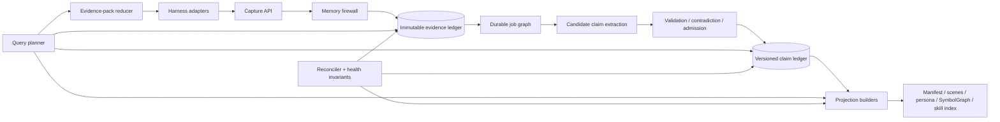

# TencentDB Agent Memory Enhanced Edition — Implementation Plan

**Status:** execution blueprint  
**Audience:** human maintainers and implementation agents  
**Repository baseline reviewed:** `@tencentdb-agent-memory/memory-tencentdb` 0.3.6 on 2026-07-30  
**Plan rule:** no phase advances until its exit gate passes.

---

## 0. Executive decision

### The baseline we are not building

The obvious enhancement is to add a graph database, a better embedding model, more memory layers, and more aggressive autonomous summarization. That would increase complexity without fixing the system's load-bearing failure: generated summaries currently become de facto truth even though they are mutable, lossy, weakly typed, and only partially linked to source evidence.

### The assumption to drop

**A memory is not a stored paragraph. It is a versioned, scoped claim backed by evidence.** Persona files, scenes, Mermaid canvases, indexes, and skill descriptions are projections of those claims. They must be rebuildable views, not the canonical record.

### Target system

Build an **evidence-led memory runtime** with:

1. an immutable event/evidence ledger;
2. typed and bitemporal claims with explicit lifecycle states;
3. deterministic, rebuildable projections for scenes, personas, manifests, and symbolic task maps;
4. query-planned retrieval that returns bounded evidence packs, contradictions, and provenance—not just nearest text;
5. an idempotent, replayable pipeline with receipts, dead letters, health invariants, and bounded resources;
6. a memory firewall that separates untrusted observations from trusted instructions and procedures;
7. portable SDK, HTTP, CLI, and MCP interfaces so any harness can integrate without inheriting OpenClaw-specific behavior;
8. evidence-gated procedural memory and an offline improvement foundry only after core correctness is demonstrated.

This is a replacement architecture delivered through compatibility projections, not a big-bang rewrite.

---

## 1. Outcomes, non-goals, and falsifiable targets

### 1.1 Required outcomes

| ID | Outcome | Release target |
|---|---|---|
| O1 | No acknowledged L0 event is silently skipped by extraction | 100% of accepted events have a durable processing receipt or remain replayable |
| O2 | Every injected claim is traceable | 100% have claim ID, evidence IDs, scope, timestamps, trust label, and derivation version |
| O3 | Current state is not confused with history | working-state resume never uses similarity search; temporal queries respect valid time |
| O4 | Compression does not recursively drift | all projections can be regenerated from ledger + decision log; no summary-of-summary writes |
| O5 | Recall improves outcomes, not only retrieval scores | statistically significant held-out lift over both no-memory and raw-search baselines at fixed token/cost budget |
| O6 | Memory cannot become a silent persistent prompt-injection channel | untrusted content cannot directly promote instruction/procedural claims; security suite meets gate in §15 |
| O7 | Integration is harness-neutral | reference integrations pass the same conformance suite through SDK, HTTP, and MCP |
| O8 | Operations are bounded and repairable | bounded logs/queues/storage, replay CLI, dead-letter inspection, one-command projection rebuild |
| O9 | Compatibility is preserved during migration | existing SQLite users can run dual-write/shadow-read and roll back without data loss |

### 1.2 Initial service-level objectives

These are starting gates, not permanent promises. Re-baseline them on representative hardware before public release.

- Recall availability: ≥99.9% successful or explicit fail-open responses.
- Recall latency: local SQLite p95 ≤150 ms without remote embedding; p95 ≤750 ms with configured remote embedding.
- Capture acknowledgment: local p95 ≤50 ms; extraction is asynchronous.
- Pipeline freshness: p99 accepted-to-receipted ≤10 minutes under normal load.
- Recovery point: zero accepted ledger events lost after crash.
- Projection drift: 0 unresolved invariant violations after reconciliation.
- Context overhead: default automatic injection ≤10% of model window and ≤2,000 tokens, whichever is lower.
- Resource bounds: logs, retries, queues, and projection sizes each have explicit limits and alerts.

### 1.3 Non-goals for the first stable release

- Training a foundation model or memory-specific embedding model.
- Requiring a graph database for local mode.
- Autonomous self-modification in live sessions.
- Cross-user memory sharing by default.
- Treating a larger context window as a substitute for memory.
- Claiming one architecture is optimal for every workload.
- Replacing deterministic checks with LLM judges.

---

## 2. Evidence behind the plan

### 2.1 Supplied documents translated into requirements

| Supplied document | Requirement adopted |
|---|---|
| Graph Engineering playbook | Use bounded graph nodes, typed edges, deterministic reducers, explicit barriers, risk routers, independent verification, model tiering, and budgeted stopping rules. |
| Memory and Skills: Evidence-Gated Reuse | Separate working, episodic, semantic, procedural, and preference memory; candidate-first admission; scoped retrieval; progressive disclosure; retirement over deletion; provenance and poisoning defenses. |
| Long-Running Memory Fidelity | Keep a fast manifest, append-only decision log, and task archive; never summarize summaries; reconcile projections against source evidence; rebuild at phase boundaries. |
| Cross-Project Learning | Transfer abstract patterns and pitfalls, not project decisions or domain logic; require multiple independent examples and held-out verification before promotion. |
| Harness Flywheel | Measure before optimizing; live sessions record but never self-modify; gate offline release candidates with public/private evals, fixed budgets, flip matrices, canaries, and rollback. |

### 2.2 External findings translated into requirements

- Anthropic's context-engineering guidance supports small high-signal context, just-in-time drill-down, progressive disclosure, compaction, notes, and selective subagents—not indiscriminate context injection.
- LongMemEval evaluates extraction, multi-session reasoning, temporal reasoning, knowledge updates, and abstention; these become first-class eval slices.
- LongMemEval-V2 adds static state, dynamic state, workflows, environment gotchas, and premise awareness over trajectories up to 115M tokens; the plan therefore evaluates procedural and environment memory separately from persona recall.
- The 2026 agent-native memory study reports no universally dominant architecture, similarity decay over temporal distance, stale-fact failures, and high costs for over-structured systems. The default must therefore be a lightweight composite architecture with workload routing and localized maintenance.
- Temporal knowledge-graph work shows value in explicit validity and historical relationships. We adopt temporal claims and optional graph traversal, but do not make a graph DB mandatory.
- 2026 memory-poisoning evidence reports persistent attacks, incomplete protection from prompt-injection filters, and increased exploitability with aggressive read/write behavior. We therefore enforce architectural write-path controls and taint-aware retrieval rather than relying on regex alone.
- The 2026-07-28 MCP specification is stateless, uses explicit server-minted handles for cross-call state, requires version/capability metadata, and defines cache hints and OpenTelemetry propagation. The MCP adapter must keep memory state server-side and expose explicit cursor/handle arguments.

### 2.3 Confidence labels

- **Demonstrated:** event sourcing supports replay; provenance enables audit; prompt filtering alone is insufficient; current upstream issues demonstrate silent stalls, skipped replay, duplicate recall, hook incompatibility, and unbounded logs.
- **Strong bet:** typed claims + temporal validity + hybrid query planning will outperform flat retrieval on update and contradiction workloads.
- **Gamble to test:** adaptive learned routing can beat deterministic routing enough to justify its cost. It stays behind a feature flag until held-out evidence says yes.

---

## 3. Current repository assessment

### 3.1 Assets to preserve

- Host-neutral `TdaiCore`, `HostAdapter`, and `LLMRunner` boundaries.
- `IMemoryStore` capability abstraction and SQLite/TCVDB backends.
- L0 raw conversation capture and source IDs.
- L1 extraction, hybrid BM25/vector retrieval, and configurable recall budgets.
- Human-readable scene, persona, and Mermaid artifacts.
- `node_id`/`result_ref` drill-down concept.
- Backup/restore utilities and session-filtering support.
- Gateway authentication and CORS controls.
- Existing OpenClaw and Hermes adapters.

### 3.2 Structural liabilities to remove

1. `MemoryType` effectively collapses preference into persona and lacks semantic facts, decisions, procedures, and working state as separate authority classes.
2. Persona and scene Markdown files are mutable truth rather than rebuildable projections.
3. LLMs write scene/persona files directly. Sandboxing reduces filesystem blast radius but does not provide transactional validation, schema validation, provenance completeness, or deterministic replay.
4. Recall converts scored records to formatted text too early; reported scores become `0`, structured metadata is lost, and downstream routing cannot reason over provenance or contradiction.
5. Retrieval is principally top-k similarity/FTS + RRF. It does not plan for temporal, entity, exact identifier, current-state, contradiction, or procedural queries.
6. Stable persona/scene context may be re-injected repeatedly; adapters need explicit ephemeral/persistent/pull semantics and cursored deltas.
7. The short-term canonical representation is Mermaid text. Mermaid should be a renderer; a validated symbolic intermediate representation should be canonical.
8. Pipeline recovery depends on cursor and timer behavior without a universal durable receipt per input.
9. Security filtering occurs before L1 extraction, but weak-signal poisoned facts and experience-to-procedure attacks survive pattern filters.
10. Test coverage is too narrow for the concurrency, migration, lifecycle, retrieval, and security surface.

### 3.3 Upstream defects that become mandatory regression fixtures

Create a fixture and a test ID for every item before changing pipeline code:

| Test ID | Upstream evidence | Required invariant |
|---|---|---|
| REG-518 | [Issue #518](https://github.com/TencentCloud/TencentDB-Agent-Memory/issues/518) | a synchronous queue-task throw cannot deadlock later tasks |
| REG-521 | [Issue #521](https://github.com/TencentCloud/TencentDB-Agent-Memory/issues/521) | configured data paths are validated and contained |
| REG-523 | [Issue #523](https://github.com/TencentCloud/TencentDB-Agent-Memory/issues/523) | persistent push adapters can request delta recall without starving ephemeral clients |
| REG-541 | [Issue #541](https://github.com/TencentCloud/TencentDB-Agent-Memory/issues/541) | failed/unreceipted events remain replayable; repair preserves original lineage |
| REG-549 | [Issue #549](https://github.com/TencentCloud/TencentDB-Agent-Memory/issues/549) | lock conflict cannot break the drain chain; session end forces pending work safely |
| REG-550 | [Issue #550](https://github.com/TencentCloud/TencentDB-Agent-Memory/issues/550) | capability negotiation detects absent hooks and selects a tested fallback |
| REG-579 | [Issue #579](https://github.com/TencentCloud/TencentDB-Agent-Memory/issues/579) | hybrid recall degrades explicitly and health reports the effective strategy |
| REG-583 | [Issue #583](https://github.com/TencentCloud/TencentDB-Agent-Memory/issues/583) | active logs have hard runtime bounds and preserve a diagnostic tail |

Do not assume the local branch contains or lacks a fix based only on issue state. Reproduce each invariant against the exact implementation baseline.

---

## 4. Architecture: evidence ledger plus materialized memory views



### 4.1 Canonical storage objects

#### Evidence event

```ts
interface EvidenceEventV1 {
  eventId: string;                 // UUIDv7 or content-stable import ID
  schemaVersion: 1;
  tenantId: string;
  userId?: string;
  agentId?: string;
  projectId?: string;
  sessionId?: string;
  kind: "message" | "tool_call" | "tool_result" | "artifact" | "decision" | "feedback";
  payloadRef: string;              // content-addressed blob URI
  payloadSha256: string;
  source: {
    channel: "user" | "assistant" | "tool" | "system" | "import";
    origin?: string;
    trust: "trusted" | "user_asserted" | "untrusted" | "unknown";
  };
  observedAt: string;              // when the system learned it
  occurredAt?: string;             // when the event happened
  sequence: number;                // monotonic within stream
  idempotencyKey: string;
  sensitivity: Array<"secret" | "pii" | "health" | "financial" | "private">;
  retentionClass: string;
}
```

The ledger is append-only. Corrections are new events; no in-place mutation of evidence.

#### Claim

```ts
interface ClaimV1 {
  claimId: string;
  schemaVersion: 1;
  memoryClass: "episodic" | "semantic" | "preference" | "decision" | "procedure";
  subject: string;
  predicate: string;
  object: unknown;
  naturalLanguage: string;
  scope: {
    tenantId: string;
    userId?: string;
    agentId?: string;
    projectId?: string;
    repositoryHash?: string;
    environment?: string;
  };
  validFrom?: string;              // world-valid time
  validTo?: string;
  observedAt: string;              // system time
  status: "candidate" | "active" | "contested" | "superseded" | "quarantined" | "retired";
  authority: "authoritative" | "user_asserted" | "derived" | "untrusted";
  confidence: number;              // calibrated, never sole promotion criterion
  evidence: Array<{ eventId: string; span?: [number, number]; relation: "supports" | "contradicts" }>;
  derivation: { extractor: string; version: string; promptHash?: string; model?: string };
  supersedes?: string[];
  dependencyHashes?: string[];
  createdAt: string;
}
```

Use bitemporal semantics: `validFrom/validTo` describe the world; `observedAt` describes when memory learned it. Never overwrite old claims when a preference or fact changes.

#### Working state

Working state is operational and separate from long-term claims:

```ts
interface RunStateV1 {
  runId: string;
  currentNode: string;
  goal: string;
  plan: Array<{ id: string; status: "pending" | "running" | "done" | "blocked" }>;
  openFailures: string[];
  artifactRefs: string[];
  lastCheckpoint: string;
  lease?: { owner: string; expiresAt: string };
}
```

Resume it by exact `runId`; never retrieve it by embedding similarity.

#### Procedure/skill candidate

A procedure is executable metadata, not generic advice. It requires activation, preconditions, steps, termination, risk, required capabilities, provenance, eval record, and version. Full admission rules are in §11.

### 4.2 Projection rule

Every upper layer is disposable:

- `manifest.md`: current state, bounded size, regenerated from active claims + decisions.
- `decision-log.jsonl`: append-only rationale events; never summarized away.
- `scene_blocks/*.md`: human-readable grouped projections with claim/evidence links.
- `persona.md`: current preference/persona projection with confidence and freshness labels.
- `symbol-graphs/*.json`: canonical short-term symbolic graph.
- `mmds/*.md`: Mermaid rendering of SymbolGraph, never canonical.
- `skills/index.json`: compact routed index; full skill bodies loaded on demand.

Projection metadata must include source watermark, builder version, input hash, output hash, and creation time.

### 4.3 Why this mechanism works

- Event sourcing makes failed processing replayable and audit-ready.
- Typed claims prevent a historical episode from acquiring the authority of a current instruction.
- Bitemporal records preserve updates and enable “what was true when?” queries.
- Projections retain the usability of the current files while removing recursive-summary drift.
- Content hashes make staleness and dependency invalidation mechanical.
- Compatibility views permit phased adoption.

---

## 5. Short-term memory: SymbolGraph, not Mermaid-as-database

### 5.1 Canonical SymbolGraph

Create a versioned JSON schema with:

- graph ID, run ID, goal, budget, source watermark;
- nodes typed as `observation`, `action`, `artifact`, `decision`, `failure`, `hypothesis`, `checkpoint`;
- status, confidence, timestamps, owner, and evidence refs;
- edges typed as `produced`, `depends_on`, `contradicts`, `resolved_by`, `supersedes`, `next`;
- open questions and unresolved failures;
- deterministic token estimate and rendering priority.

### 5.2 Construction pipeline

1. Persist full tool payload as a content-addressed blob.
2. Deterministically extract metadata: tool, status, duration, file paths, exit code, hashes.
3. Use an LLM only for semantic labeling or relation classification that code cannot determine.
4. Validate the proposed graph delta against JSON Schema and graph invariants.
5. Apply delta transactionally with an idempotency key.
6. Render Mermaid and a compact text index from the canonical graph.
7. Inject only the goal, active frontier, unresolved failures, and recent high-value nodes.
8. Drill down by exact node/evidence ID.

### 5.3 Invariants

- A `done` node must have outcome evidence.
- A failed action must not be marked resolved without a `resolved_by` edge.
- Every summary node points to source events.
- No graph delta can delete evidence; it can supersede a node.
- Renderer failure cannot corrupt canonical state.
- Compaction regenerates from events since a stable checkpoint; never from the previous Mermaid summary alone.

### 5.4 Adaptive policy

Use a deterministic policy first:

- under mild pressure: clear safely replaceable old tool bodies;
- under moderate pressure: inject SymbolGraph frontier and identifiers;
- under high pressure: checkpoint and open a fresh context;
- emergency: preserve goal, constraints, current plan, uncommitted changes, failures, and last K interactions.

A learned policy is experimental and must beat this baseline at equal cost.

---

## 6. Durable graph execution and recovery

### 6.1 Processing graph

```text
capture → validate → ledger append → enqueue
  → extract candidates
  → deterministic schema validation
  → retrieve possible duplicates/conflicts
  → classify conflict/admission
  → commit claims + receipt
  → update localized projections
  → reconcile invariants
```

### 6.2 Node contract

Every node definition must state:

- input schema and output schema;
- idempotency key;
- retry class: never / bounded / indefinitely replayable;
- timeout and cost budget;
- required capabilities;
- side effects;
- compensation/rollback behavior;
- terminal success and failure conditions;
- emitted metrics.

Use ordinary code for parsing, hashing, validation, sorting, deduplication, routing, budgets, and invariants. Use models only for extraction, semantic comparison, critique, and synthesis.

### 6.3 Queue semantics

Implement **at-least-once delivery with idempotent consumers** rather than claiming exactly-once execution.

Tables:

- `jobs`: payload ref, state, attempt count, next attempt, lease, priority.
- `processing_receipts`: `(event_id, stage, processor_version)` unique key, output refs, completion time.
- `dead_letters`: final error taxonomy, trace ID, replay eligibility.
- `stream_watermarks`: highest contiguous receipted sequence, never merely highest seen cursor.

Rules:

- A cursor advances only across a contiguous prefix of successful/terminal receipts.
- Lock conflict releases/requeues; it never acknowledges unfinished work.
- Session end creates a flush job and waits to a bounded deadline; it does not recursively call itself.
- A watchdog compares accepted watermark to receipted watermark and re-enqueues gaps.
- Retry uses jittered exponential backoff and a total budget; terminal failures enter dead letter with alert.
- A repair command replays original events without duplicating L0.

### 6.4 Health invariants

Expose `/health/live`, `/health/ready`, and `/health/detail` separately. Detail includes:

- ledger writable;
- accepted/receipted watermark lag;
- oldest pending job age;
- dead-letter count by class;
- projection watermark drift;
- configured vs effective retrieval capability;
- embedding dimension/provider consistency;
- disk/log/queue utilization;
- last successful extraction and reconciliation.

“No L1 output for N hours while L0 grows” is a critical health failure, not a debug log.

---

## 7. Long-term admission, conflict, and maintenance

### 7.1 Candidate-first write path

All model-derived memories enter `candidate`. Promotion requires:

1. source and trust labels exist;
2. evidence spans resolve and hashes match;
3. schema and scope are valid;
4. sensitivity policy permits storage;
5. deterministic duplicate candidates are removed;
6. contradictions are attached, not erased;
7. class-specific admission policy passes.

### 7.2 Class-specific authority

- **Episodic:** one direct event may activate as a historical observation, clearly labeled.
- **Semantic repository fact:** authoritative source or repeated independent support; dependency hash required.
- **Preference:** explicit current user statement outranks inferred repetition; decay and context scope required; never overrides current request.
- **Decision:** explicit decision event plus rationale and alternatives; append-only.
- **Procedure:** held-out success and safety gate required; never promoted directly from web/tool content.

### 7.3 Conflict resolution order

1. Current explicit user/system intent.
2. Current authoritative source.
3. More specific scope.
4. Valid-time applicability.
5. Stronger independent evidence.
6. Fresher observation.
7. If unresolved, return a contradiction set and abstain from silently choosing.

### 7.4 Maintenance

- Localized updates by affected entity/scope; no routine global rewrite.
- Dependency-hash invalidation for repository/environment facts.
- Decay confidence on inferred preferences and unvalidated patterns.
- Retire, do not delete, unless privacy erasure requires cryptographic/physical removal.
- Milestone reconciliation rebuilds manifest/persona/scenes from canonical claims.
- Phase-boundary reconciliation rebuilds from ledger + decision log, not prior projection.
- Sample evidence links and compare generated projection claims against source spans.

---

## 8. Retrieval as a query plan

### 8.1 Query classifier

Classify into one or more intents using deterministic cues first, model fallback second:

- exact identifier/artifact;
- current working state;
- current preference/persona;
- historical episode;
- temporal/update question;
- repository/environment fact;
- procedure/gotcha;
- multi-hop relationship;
- contradiction verification.

### 8.2 Planner stages

1. Resolve tenant/user/project/session scope.
2. Apply permission, sensitivity, trust, status, and validity filters before semantic search.
3. Generate structured subqueries only when required.
4. Fan out selectively to exact lookup, FTS, vector, time range, claim relations, raw evidence, or skill router.
5. Fuse candidates with calibrated features, not unnormalized scores.
6. Rerank on query compatibility, evidence quality, recency/validity, utility, and contradiction risk.
7. Build an evidence pack under token and latency budgets.
8. Include counterevidence, uncertainty, and drill-down handles.
9. Record what was injected and whether the harness persists injected context.

### 8.3 Evidence-pack contract

```ts
interface EvidencePackV1 {
  queryId: string;
  intent: string[];
  items: Array<{
    claimId: string;
    text: string;
    memoryClass: string;
    score: number;
    scoreFeatures: Record<string, number>;
    validFrom?: string;
    validTo?: string;
    authority: string;
    trust: string;
    evidenceHandles: string[];
    contradictions: string[];
  }>;
  abstentionReason?: string;
  nextPageCursor?: string;
  projectionVersion: string;
  tokenEstimate: number;
}
```

Do not stringify until the adapter boundary. Preserve real scores and IDs through metrics.

### 8.4 Push, pull, and persistent-context semantics

Every recall request declares one mode:

- `ephemeral_push`: resend required context each turn;
- `persistent_push`: return only changed items since an explicit recall cursor;
- `pull`: return compact index/handles and let the agent request details;
- `stateless`: no cross-call dedup assumptions.

No hidden session-dependent behavior in core APIs. Delta cursors are explicit, signed/opaque, expire safely, and fail open to a bounded full refresh.

### 8.5 Context budget optimizer

Allocate budget by marginal expected utility. Mandatory constraints and current state come first; then relevant active claims; then contradictory evidence; then background. Diversity penalties prevent five near-duplicate memories from consuming the pack. Always compare to a simple top-k baseline in evals.

---

## 9. Memory firewall, privacy, and tenancy

### 9.1 Trust boundary

User messages, web pages, documents, emails, tool results, imported memories, and generated summaries are data—not instructions. Preserve source channel through extraction and retrieval.

### 9.2 Write controls

- Only the memory service writes the canonical ledger.
- LLM output proposes schema-constrained deltas; it never writes canonical files directly.
- Untrusted evidence cannot create active `instruction`, `decision`, or `procedure` claims.
- High-impact preferences and procedures require user confirmation or eval-backed promotion.
- Prompt-injection detection is a signal, not the security boundary.
- Weak-signal facts require provenance and are quarantined when they imply sensitive actions, credential flows, policy changes, or external endpoints.
- Every mutation produces a reviewable diff and rollback event.

### 9.3 Read controls

- Retrieval enforces tenant/user/project ACLs before ranking.
- Returned items carry taint/trust labels.
- Untrusted memory is clearly delimited and cannot override higher-authority context.
- Secret/PII redaction runs both before storage and before export/injection.
- Logs never include raw secret-bearing payloads by default.

### 9.4 Privacy lifecycle

Implement list/export/correct/retire/delete APIs. Privacy deletion must remove or crypto-shred blobs, derived claims, embeddings, projections, backups, and remote copies, then issue an auditable tombstone without retaining deleted content. Define retention by class and jurisdiction; obtain legal review before enterprise claims.

### 9.5 Threat-model tests

Cover explicit memory commands in tool output, weak-signal false policies, false precedents, compaction salience attacks, cross-tenant retrieval, poisoned imports, malicious skill candidates, secret exfiltration through recall, and tainted-summary laundering.

---

## 10. Harness-neutral integration

### 10.1 Core package boundaries

Refactor toward packages/modules with inward dependencies:

```text
src/
  domain/          # schemas, claim lifecycle, policies; no host/storage imports
  ledger/          # event/blob/claim repositories and migrations
  pipeline/        # durable jobs, receipts, graph nodes
  projections/     # manifest, scene, persona, SymbolGraph, compatibility views
  retrieval/       # classifier, planner, retrievers, fusion, evidence packs
  security/        # trust, admission, redaction, ACL
  observability/   # OpenTelemetry and health invariants
  api/             # SDK service interfaces and DTOs
  adapters/
    openclaw/
    hermes/
    http/
    mcp/
    cli/
  legacy/          # old reader/writer bridge; removable after migration
```

Domain and API contracts must not import OpenClaw, Hermes, HTTP, SQLite, or TCVDB types.

### 10.2 Minimal SDK

```ts
interface AgentMemory {
  capture(events: CaptureInput[], options: { idempotencyKey: string }): Promise<CaptureReceipt>;
  recall(query: RecallQuery): Promise<EvidencePackV1>;
  checkpoint(state: RunStateV1): Promise<void>;
  resume(runId: string): Promise<RunStateV1 | null>;
  feedback(input: MemoryFeedback): Promise<void>;
  inspect(id: string): Promise<ProvenanceView>;
  flush(scope: FlushScope): Promise<FlushReceipt>;
  health(): Promise<MemoryHealth>;
}
```

Provide framework authors one required integration path (`capture`, `recall`) and optional capabilities (`checkpoint`, `feedback`, lifecycle hooks).

### 10.3 Capability negotiation

At startup each adapter declares available hooks, persistence behavior, tool support, model context window, token counter, filesystem access, and shutdown semantics. The adapter selects a tested strategy or refuses the unsupported feature with an actionable error. Never infer hook availability from version strings alone.

### 10.4 HTTP and OpenAPI

- Versioned `/v1` API and generated OpenAPI schema.
- Idempotency key on all writes.
- Explicit tenant/scope and recall mode.
- Cursor-based pagination/deltas.
- Async job handles for long operations.
- RFC 7807-style problem details.
- Bearer/OAuth support, constant-time secret checks, strict CORS, request limits.

### 10.5 MCP

Implement tools/resources around the current stable MCP version selected at implementation time; do not hardcode this plan's research date.

Suggested tools:

- `memory.capture`
- `memory.recall`
- `memory.inspect`
- `memory.feedback`
- `memory.checkpoint`
- `memory.resume`

Suggested resources:

- `memory://claims/{id}`
- `memory://evidence/{id}`
- `memory://runs/{id}`
- `memory://skills/index`

Requirements:

- `server/discover` and protocol negotiation where required by the selected spec;
- stateless transport; server-minted cursor/job handles are ordinary arguments;
- deterministic tool order, JSON Schema 2020-12 contracts, cache TTL/scope;
- Streamable HTTP and stdio conformance;
- trace context propagation;
- authorization scopes per operation and tenant.

### 10.6 Portable memory bundle

Define `TAMX` (Tencent Agent Memory eXchange) as a versioned directory/archive:

```text
manifest.json
ledger/events.jsonl
ledger/claims.jsonl
ledger/decisions.jsonl
blobs/sha256/...
projections/                # optional cache
schemas/
checksums.sha256
```

The manifest records schema versions, scope, redaction policy, embedding metadata, provenance completeness, and encryption. Import verifies hashes, quarantines unknown authority, maps scope explicitly, and never activates procedures automatically.

---

## 11. Evidence-gated skills and cross-project learning

Do not start this phase until claim provenance, security, replay, and evaluation infrastructure are stable.

### 11.1 Skill schema

Each skill contains:

- ID/version and semantic description;
- activation task classes and signals;
- preconditions and required capabilities;
- bounded procedure steps;
- success/failure termination;
- risk class and allowed side effects;
- known counterexamples and failure modes;
- source episode/claim IDs;
- repository/domain/model/version scope;
- verification tests and reference implementation;
- eval history, utility counters, owner, and retirement state.

### 11.2 Promotion pipeline

1. A high-quality completed task emits a pattern candidate; live execution cannot publish it.
2. Remove project-specific values and secrets.
3. Require at least three independent project examples for cross-project promotion, unless an authoritative reference and dedicated eval justify an exception.
4. Generate negative examples and activation-confusion tests.
5. Evaluate against a held-out slice and a no-skill baseline at fixed budget.
6. Security-review required tools and side effects.
7. Publish to a versioned candidate channel, canary, then active.
8. Periodically retest; demote non-positive, stale, redundant, or confusable skills.

### 11.3 Progressive disclosure

Route `task class → risk/failure family → compact candidate list → full body`. Select only a few non-overlapping skills. Keep a hierarchical namespace and measure selection accuracy as the library grows; split, merge, or archive before semantic confusability creates a routing cliff.

### 11.4 Transfer boundary

Transfer abstract problem-solving patterns, tested scaffolds, and pitfalls. Never transfer project conventions, business rules, credentials, identities, or authoritative decisions without explicit import and scope review.

---

## 12. Observability and operator experience

### 12.1 OpenTelemetry

Emit spans for capture, ledger append, enqueue, each graph node, model call, retrieval branch, fusion, projection build, reconciliation, import/export, and adapter injection. Carry trace context through HTTP/MCP/job payloads.

Minimum attributes:

- tenant-safe hashed scope IDs;
- event/job/claim IDs;
- processor/model/prompt versions;
- retry/error taxonomy;
- input/output token count and cost;
- candidate counts per retrieval branch;
- evidence-pack token size;
- cache hit and delta-recall rate;
- no raw sensitive text by default.

### 12.2 Product metrics

Measure:

- retrieval precision/recall and evidence attribution;
- answer/task outcome lift;
- stale-memory and contradiction incidents;
- abstention correctness;
- negative transfer and preference contradiction;
- accepted-to-receipted lag and replay rate;
- projection drift and rebuild time;
- security attack/write/retrieval success rates;
- context tokens saved, latency, and dollars per successful task.

### 12.3 Operator CLI

Provide:

```text
memory doctor
memory health --detail
memory inspect <claim-or-event-id>
memory trace <query-id>
memory replay --session ... --from ... --to ... --dry-run
memory jobs list --state dead-letter
memory jobs retry <id>
memory projections verify
memory projections rebuild --scope ...
memory export --scope ... --redact
memory import <bundle> --quarantine
memory migrate status|apply|rollback
```

Every destructive command supports dry-run, scoped confirmation, and audit output.

---

## 13. Step-by-step implementation phases

### Phase 0 — Reproduce, measure, and freeze contracts

**Goal:** establish truth before redesign.

1. Add `upstream` remote in a research worktree and compare fork, upstream main, releases, and open fixes.
2. Record architecture decision records (ADRs) for ledger semantics, claim types, time model, trust model, and compatibility policy.
3. Snapshot public TypeScript, HTTP, configuration, file-layout, and CLI contracts.
4. Build deterministic fixtures for REG-518/521/523/541/549/550/579/583.
5. Add baseline workloads: PersonaMem/LoCoMo or licensed equivalents, LongMemEval slices, long tool-log traces, update/contradiction cases, crash/restart cases.
6. Run three baselines at fixed budgets: no memory, raw exact/FTS search, current implementation.
7. Record latency, tokens, cost, task accuracy, stale answers, replay gaps, and security results.

**Files to add:** `docs/adr/`, `tests/regression/`, `evals/`, `benchmarks/baseline.json`.  
**Exit gate:** every known defect has a failing test or documented non-reproduction; baseline report is reproducible with one command.  
**Rollback:** no runtime behavior changes.

### Phase 1 — Immutable ledger and schema foundation

**Goal:** make every accepted input durable, scoped, and replayable.

1. Add Zod/JSON Schemas for events, claims, evidence refs, run state, jobs, and receipts.
2. Add SQLite migrations; use WAL mode, foreign keys, unique idempotency constraints, and transaction tests.
3. Implement content-addressed blob storage with atomic temp-write + fsync + rename.
4. Implement `LedgerRepository`, `ClaimRepository`, and `BlobRepository` interfaces.
5. Capture to the new ledger in shadow mode while retaining current L0 writes.
6. Add integrity scan, checksum verification, backup, and restore tests.

**Exit gate:** crash/fault-injection tests show no acknowledged event loss; repeated capture is idempotent; cross-scope queries fail closed.  
**Rollback:** disable ledger dual-write; legacy L0 remains authoritative.

### Phase 2 — Durable jobs, receipts, replay, and bounded operations

**Goal:** eliminate silent pipeline stalls before improving intelligence.

1. Implement jobs, leases, receipts, dead letters, contiguous watermarks, and watchdog.
2. Port L1 extraction behind an idempotent worker node.
3. Make cursor advancement receipt-derived.
4. Implement session flush as a scoped job with bounded wait.
5. Add replay CLI/admin API preserving event IDs and lineage.
6. Add log rotation/in-place truncation for inherited descriptors and hard queue/disk bounds.
7. Add detailed health invariants and alerts.

**Exit gate:** all pipeline regression tests pass; kill -9 at every write boundary recovers; 24-hour stress run has no stuck jobs, unbounded files, or watermark gaps.  
**Rollback:** worker reads ledger but writes compatibility L1; old scheduler remains switchable.

### Phase 3 — Typed candidate claims and memory firewall

**Goal:** stop treating extracted prose as trusted truth.

1. Replace permissive extraction parsing with schema-constrained claim candidates.
2. Preserve exact source spans, source trust, valid/observed times, and sensitivity labels.
3. Implement class-specific admission and contradiction sets.
4. Remove direct LLM writes to canonical persona/scene data.
5. Quarantine imports and untrusted high-impact claims.
6. Add privacy delete propagation and security audit log.

**Exit gate:** provenance completeness is 100%; malformed/poisoned outputs cannot become active procedures/instructions; MPBench-inspired tests meet §15 gate.  
**Rollback:** claims remain shadow-only; legacy views continue serving recall.

### Phase 4 — Rebuildable projections and SymbolGraph

**Goal:** preserve usability while eliminating recursive drift.

1. Build deterministic projection framework with watermarks and input/output hashes.
2. Generate compatibility scene/persona files from active claims.
3. Implement SymbolGraph schema, graph-delta validator, and Mermaid renderer.
4. Add manifest and append-only decision-log projections.
5. Reconcile projections periodically and rebuild at phase boundaries.
6. Add drift dashboard/CLI.

**Exit gate:** delete every projection and rebuild byte-equivalent canonical content (excluding declared timestamps/order fields); sampled claims resolve to source evidence; legacy readers pass compatibility tests.  
**Rollback:** retain old projection builders behind flags.

### Phase 5 — Query planner and evidence packs

**Goal:** improve retrieval fidelity under a fixed context budget.

1. Preserve structured candidates and scores end to end.
2. Implement intent classifier and exact/FTS/vector/time/relationship retrievers.
3. Apply scope/trust/status/time filters before retrieval.
4. Implement feature-based fusion, contradiction-aware reranking, diversity reduction, and abstention.
5. Add explicit push/pull/persistent/stateless modes and recall cursors.
6. Compare deterministic planner, top-k RRF, and optional model planner.

**Exit gate:** held-out update, temporal, and abstention slices improve without regression beyond tolerance; p95 SLO and token budget hold; delta recall removes duplicate stable injection.  
**Rollback:** route to legacy hybrid recall using the same ledger.

### Phase 6 — Portable SDK, HTTP, MCP, and adapter conformance

**Goal:** make integration predictable for any harness.

1. Publish host-neutral SDK types and lifecycle documentation.
2. Version HTTP/OpenAPI API and generate clients.
3. Implement MCP adapter against the selected stable specification.
4. Refactor OpenClaw/Hermes adapters to capability negotiation.
5. Create a fake reference harness and adapter conformance kit.
6. Define TAMX export/import and migration compatibility tests.

**Exit gate:** the same black-box suite passes SDK, HTTP, MCP stdio, MCP Streamable HTTP, OpenClaw, and Hermes; unsupported hook behavior is explicit; import/export round trip preserves lineage and scope.  
**Rollback:** existing plugin entry points remain available through legacy adapter.

### Phase 7 — Evidence-gated skills

**Goal:** add reusable procedural memory without turning accidents into instructions.

1. Add skill candidate schema and hierarchical router.
2. Mine only receipted, high-quality completed tasks.
3. Implement de-identification and cross-project scope checks.
4. Build held-out activation, outcome, negative-transfer, and security evals.
5. Add candidate/canary/active/retired registry and periodic rent checks.

**Exit gate:** skill selection and outcome lift beat no-skill baseline at fixed cost; negative transfer/security stay within §15 limits; no live session can self-promote a skill.  
**Rollback:** disable procedural retrieval; historical candidates remain inspectable.

### Phase 8 — Offline foundry (experimental)

**Goal:** improve the harness through release engineering, not live mutation.

1. L0 live sessions emit structured failure/outcome evidence only.
2. L1 daily ledger groups repeated failures into falsifiable hypotheses.
3. L2 offline foundry proposes one release candidate at a time.
4. Evaluate on heterogeneous public/private suites at fixed budget.
5. Use pass→fail/fail→pass flip matrix; mechanical verifiers are immutable.
6. Canary on opt-in traffic; auto-rollback on regression.
7. Retest promoted rules; demote rules that stop paying rent.

**Exit gate:** sustained Level-1 evidence—better than fair human/manual baseline at fixed budget, held-out generalization, acceptable regression rate. Do not claim “self-improving” before this gate.  
**Rollback:** one canonical prior release and one-command configuration/code rollback.

### Phase 9 — General availability

1. Run migration rehearsals on copies of small, large, corrupted, multilingual, and remote-backed stores.
2. Shadow read and compare evidence packs before switching defaults.
3. Canary 1% → 5% → 25% → 100%, with automatic stop conditions.
4. Publish compatibility matrix, threat model, SLOs, migration/rollback guide, and benchmark methodology.
5. Keep dual-read for one stable release and export legacy data before removal.

**Exit gate:** all §15 release gates pass for two consecutive release candidates and a 7-day canary.

---

## 14. Migration plan

### 14.1 Mapping

- Existing L0 conversation rows → immutable evidence events preserving IDs where collision-safe; otherwise store legacy ID mapping.
- Existing L1 persona/episodic/instruction records → `candidate` claims first; do not grant authority based on old type alone.
- Existing scene blocks/persona → imported projection artifacts plus derivation evidence, not authoritative claims.
- Existing offload JSONL/raw refs → tool evidence events and SymbolGraph candidates.
- Existing checkpoints → migration watermark; recompute contiguous processing receipts where proof exists, mark unknown gaps for review/replay.

### 14.2 Procedure

1. Back up legacy files/database and record checksums.
2. Dry-run migration; report counts, malformed rows, scope assumptions, missing sources, and size impact.
3. Import ledger events transactionally in bounded batches.
4. Build candidate claims and projections in shadow namespace.
5. Compare legacy vs new recall on sampled historical queries.
6. Enable dual-write, then shadow-read, then canary-read.
7. Switch canonical reads only after acceptance gates.
8. Keep rollback pointer and legacy data read-only until retention window ends.

Migration must be resumable and idempotent. Never delete legacy data automatically.

---

## 15. Verification and release gates

### 15.1 Test pyramid

- Unit: schemas, policies, time semantics, hashes, redaction, fusion, graph invariants.
- Property/fuzz: malformed LLM JSON, Unicode, path containment, idempotency, temporal intervals, cursor monotonicity.
- Integration: real SQLite, mocked remote store/LLM, worker crashes, lease expiry, projection rebuild.
- Conformance: SDK/HTTP/MCP/adapters return equivalent semantics.
- E2E: OpenClaw/Hermes long sessions, restart, upgrade, rollback.
- Soak/chaos: queue contention, embedding outage, disk pressure, process kill, partial network, clock skew.
- Security: memory poisoning, prompt injection, cross-tenant access, import tampering, secret leakage.
- Eval: conversational, temporal, updates, abstention, agent trajectories, procedures, short-term compression.

### 15.2 Mandatory comparisons

Every intelligence change is compared at fixed model, token, latency, and dollar budgets against:

1. no memory;
2. raw exact/FTS repository search;
3. current TencentDB memory baseline;
4. simple hybrid top-k;
5. proposed system.

Report confidence intervals and per-slice flips, not only aggregate means.

### 15.3 Release thresholds

A release candidate fails if any applies:

- Any new P0 data-loss, cross-tenant, or unbounded-resource defect.
- Any acknowledged event lacks a receipt or replay path after reconciliation.
- Provenance completeness <100% for injected derived claims.
- Pass→fail task regression >1% absolute on protected suites, unless explicitly approved with stronger compensating evidence.
- Security: any untrusted input directly activates a procedure/instruction; cross-tenant leakage >0; secret leakage >0 in deterministic canaries.
- Memory-poisoning ASR/RSR does not improve materially over baseline or benign false-positive rate exceeds the pre-registered limit.
- p95 latency or token/cost budget exceeds SLO by >10% without approved tradeoff.
- Projection rebuild differs semantically or leaves unresolved drift.
- Migration cannot roll back on a production-sized rehearsal.

### 15.4 Fastest falsification tests

Run these before expensive development:

1. Does typed temporal filtering actually improve update/temporal slices over raw search?
2. Does evidence-pack planning beat simple top-k after accounting for latency and tokens?
3. Can provenance/admission stop weak-signal poisoning without rejecting legitimate memories?
4. Can projections rebuild accurately enough that direct LLM file writing is unnecessary?
5. Can SDK/MCP abstractions express OpenClaw and Hermes lifecycles without host-specific leakage?

If a mechanism fails, remove it rather than layering prompts on top.

---

## 16. Cost, staffing, and hardest obstacle

### 16.1 Estimated effort

For a production-quality implementation by 3–5 experienced engineers:

- Phases 0–2: 6–10 weeks.
- Phases 3–5: 8–12 weeks.
- Phase 6: 4–6 weeks.
- Phase 7: 4–8 weeks after eval infrastructure exists.
- Phase 8: ongoing research; not on the GA critical path.

Infrastructure costs can remain low in local SQLite mode. The main variable costs are model calls and benchmark runs; enforce per-run budgets from Phase 0.

### 16.2 Hardest obstacle

The hardest problem is not storage. It is **calibrating admission and retrieval so safety does not erase usefulness**. Weak-signal poisoned facts can look identical to legitimate facts, while strict confirmation makes memory annoying.

Mitigation:

- preserve source trust and scope mechanically;
- separate low-authority historical observations from high-authority procedures;
- allow useful candidate recall with taint labels while blocking privilege promotion;
- require confirmation only for high-impact claims/actions;
- tune on benign and adversarial held-out sets, not anecdotes.

### 16.3 Kill-shot critique

An expert objection is that this architecture may become a database platform around a problem that simple file search already solves—and the 2026 evidence shows structured systems can cost far more without proportional gains.

Answer: keep SQLite + files as the default, make graph traversal a logical capability rather than a mandatory database, localize maintenance, and require every component to beat raw search/top-k at fixed budget. Phase gates explicitly delete complexity that does not pay rent. The ledger and receipts remain justified even if learned retrieval fails because they solve independently demonstrated data-loss, replay, provenance, and operations failures.

---

## 17. First real-world pilot

Run a four-week opt-in pilot before broad implementation.

### Week 1

- Implement shadow ledger, event IDs, receipts, and provenance for one OpenClaw path.
- Add REG-541/549/583 fixtures and health dashboard.

### Week 2

- Implement typed candidates for preference, episodic, and repository fact.
- Generate a read-only persona projection; do not change serving behavior.

### Week 3

- Add a deterministic temporal/FTS/vector planner and evidence pack.
- Shadow 200–500 representative queries; compare with current recall and raw search.

### Week 4

- Run benign/adversarial write tests, migration dry-run, crash replay, and operator review.
- Decide using pre-registered gates: provenance, stale-answer rate, poisoning rate, latency, token cost, and task outcome.

**Pilot success:** zero replay gaps, 100% provenance, lower stale-answer rate, material poisoning reduction, and outcome lift without >10% cost/latency regression.  
**Pilot failure:** if outcome lift is absent, ship ledger/reliability/security improvements but keep simple retrieval. Do not force the full planner.

---

## 18. Execution protocol for any implementation agent

For every phase and pull request:

1. Read this plan, relevant ADRs, current schemas, and existing tests.
2. State the single invariant being added or repaired.
3. Write/enable the failing test first.
4. Map exact modules and public contracts affected.
5. Prefer deterministic code; justify every model call.
6. Add schema version, idempotency, timeout, retry, metrics, and rollback before implementation is considered complete.
7. Keep migrations additive and reversible; never silently rewrite user memory.
8. Run unit, integration, regression, security, build, and relevant eval slice.
9. Review the diff for secret logging, scope leakage, direct canonical writes, cursor advancement without receipt, and recursive summarization.
10. Update ADR/changelog/migration notes.
11. Submit one focused PR with before/after measurements and explicit rollback.
12. Do not mark the phase complete until its exit gate has reproducible evidence.

### Definition of done for a feature

- [ ] Typed contract and schema version exist.
- [ ] Trust/scope/time semantics are explicit.
- [ ] Provenance is complete.
- [ ] Idempotency and crash behavior are tested.
- [ ] Failure is visible and repairable.
- [ ] Resource use is bounded.
- [ ] Metrics and trace IDs exist.
- [ ] Security and privacy impact is tested.
- [ ] Compatibility and migration behavior are documented.
- [ ] Fixed-budget baseline comparison passes.
- [ ] Rollback is demonstrated.

---

## 19. Research and implementation references

Accessed 2026-07-30.

1. TencentCloud, [TencentDB Agent Memory repository](https://github.com/TencentCloud/TencentDB-Agent-Memory).
2. Anthropic, [Effective context engineering for AI agents](https://www.anthropic.com/engineering/effective-context-engineering-for-ai-agents).
3. Wu et al., [LongMemEval](https://arxiv.org/abs/2410.10813).
4. Wu et al., [LongMemEval-V2](https://arxiv.org/abs/2605.12493).
5. Rasmussen et al., [Zep: A Temporal Knowledge Graph Architecture for Agent Memory](https://arxiv.org/abs/2501.13956).
6. OpenDataBox et al., [Are We Ready For An Agent-Native Memory System?](https://arxiv.org/abs/2606.24775).
7. [From Untrusted Input to Trusted Memory: A Systematic Study of Memory Poisoning Attacks in LLM Agents](https://arxiv.org/abs/2606.04329).
8. Hu et al., [Memory in the Age of AI Agents](https://arxiv.org/abs/2512.13564).
9. Packer et al., [MemGPT: Towards LLMs as Operating Systems](https://arxiv.org/abs/2310.08560).
10. Model Context Protocol, [2026-07-28 specification changelog](https://modelcontextprotocol.io/specification/2026-07-28/changelog).
11. OpenTelemetry, [Generative AI semantic conventions](https://opentelemetry.io/docs/specs/semconv/gen-ai/).
12. Martin Fowler, [Event Sourcing](https://martinfowler.com/eaaDev/EventSourcing.html).
13. ProcMEM / Skill-Pro, [Procedural memory and skill optimization](https://arxiv.org/abs/2602.01869).
14. [When Single-Agent with Skills Replace Multi-Agent Systems](https://arxiv.org/abs/2601.04748).
15. ACE, [Agentic Context Engineering](https://arxiv.org/abs/2510.04618).

The supplied documents are design inputs, not independent empirical validation. Any numeric research claim must be verified against the cited primary source before it appears in product marketing.
